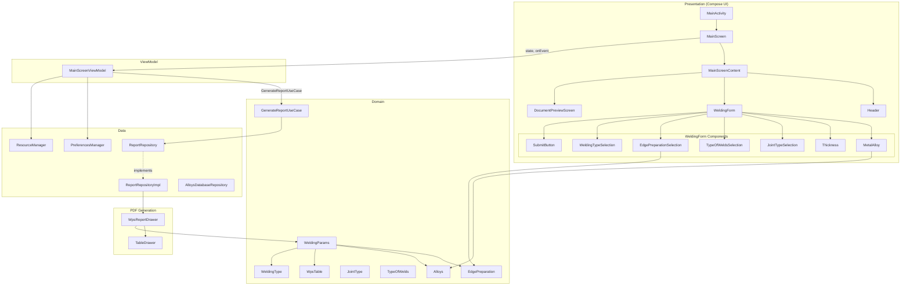
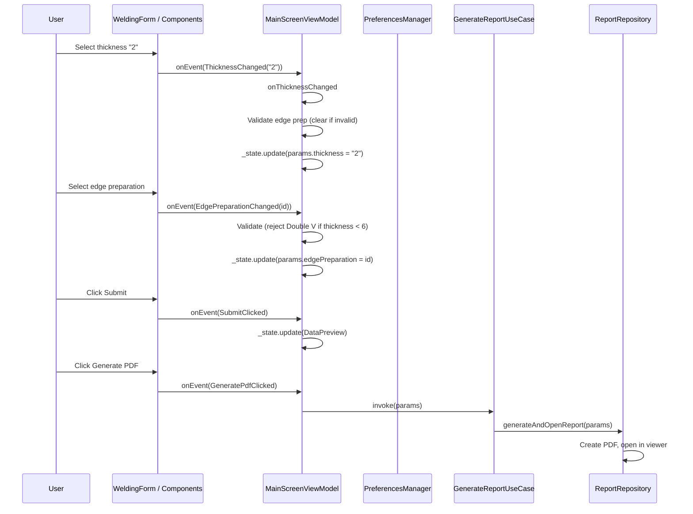
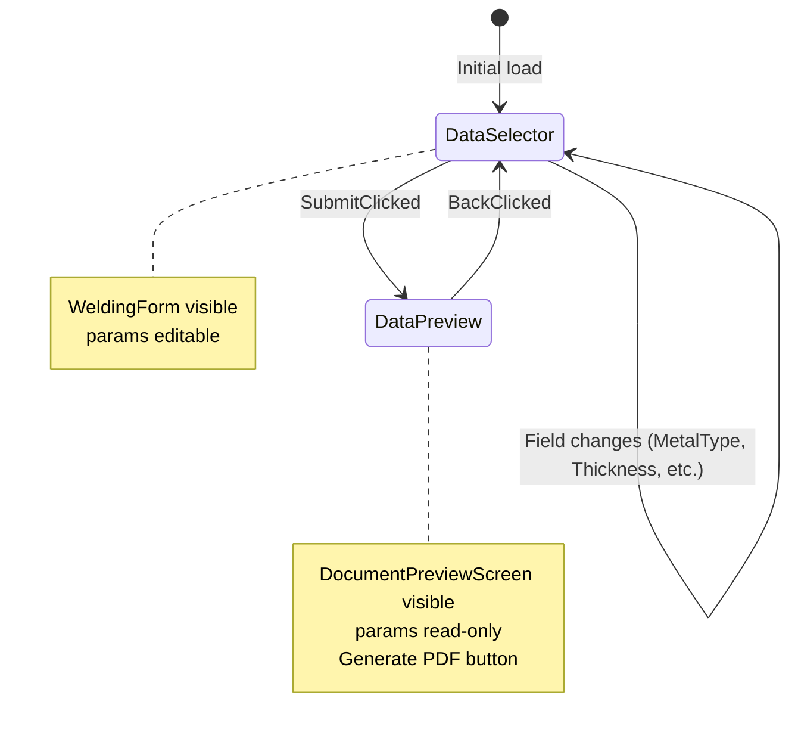
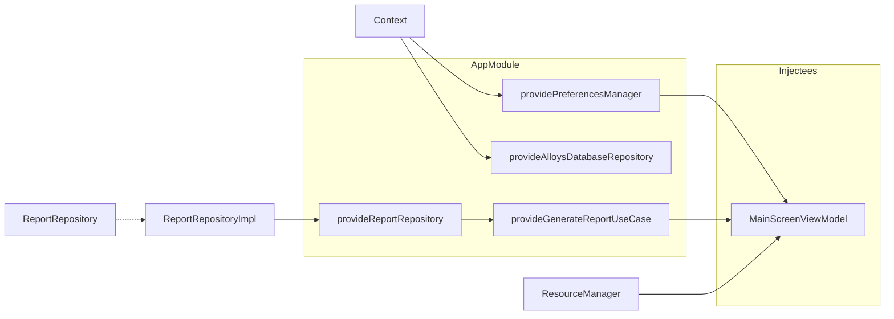
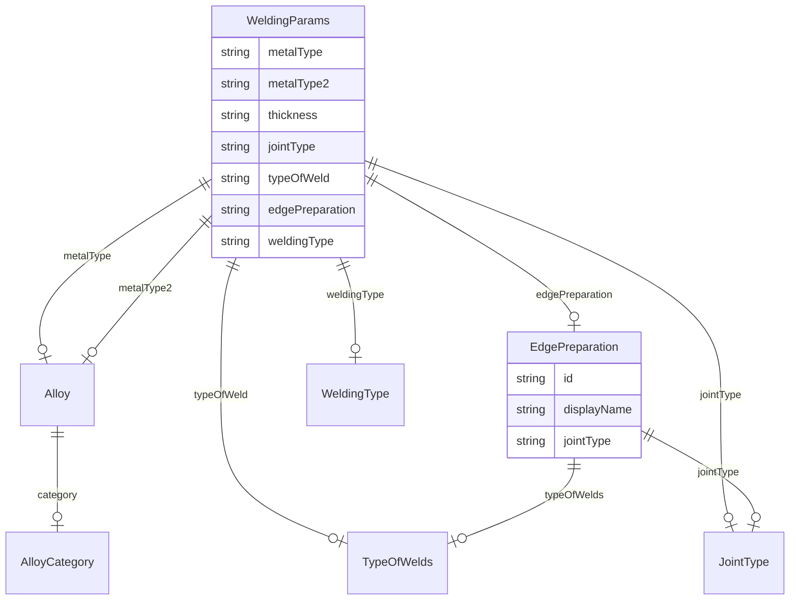
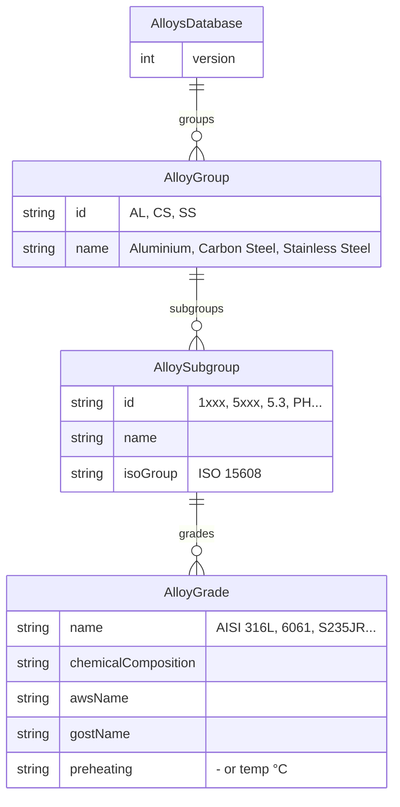
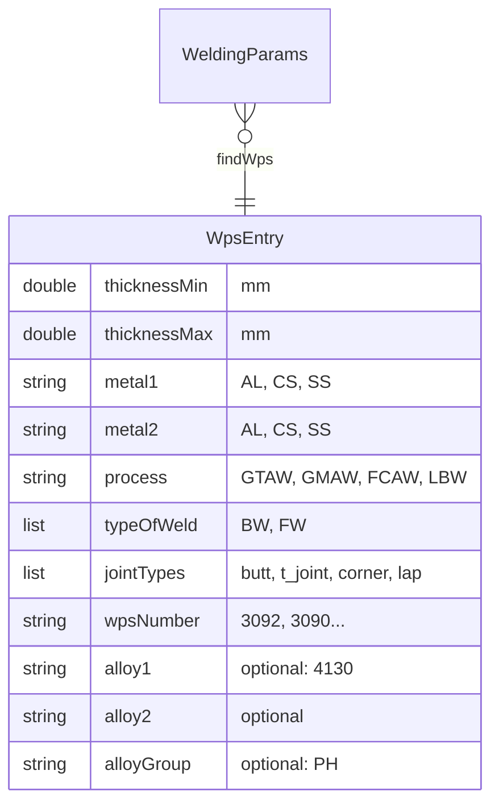

# WeldEdge — Architecture & Flow Diagrams

## 1. High-Level Architecture (Layers)

```
┌─────────────────────────────────────────────────────────────────────────┐
│                         PRESENTATION LAYER                               │
│  MainActivity → MainScreen → MainScreenContent                           │
│  Components: WeldingForm, DocumentPreviewScreen, Header, etc.           │
└─────────────────────────────────────────────────────────────────────────┘
                                    │
                                    │ state / events
                                    ▼
┌─────────────────────────────────────────────────────────────────────────┐
│                         VIEWMODEL LAYER                                  │
│  MainScreenViewModel (StateFlow<MainScreenState>, MainScreenEvent)        │
└─────────────────────────────────────────────────────────────────────────┘
                                    │
                                    │ use cases, preferences
                                    ▼
┌─────────────────────────────────────────────────────────────────────────┐
│                         DOMAIN LAYER                                     │
│  GenerateReportUseCase, Models (WeldingParams, EdgePreparation, etc.)    │
└─────────────────────────────────────────────────────────────────────────┘
                                    │
                                    │ repository interface
                                    ▼
┌─────────────────────────────────────────────────────────────────────────┐
│                         DATA LAYER                                       │
│  ReportRepositoryImpl, AlloysDatabaseRepository, PreferencesManager     │
└─────────────────────────────────────────────────────────────────────────┘
```

---

## 2. Component Diagram (Mermaid)



---

## 3. Event Flow (User Action → State Update)



---

## 4. State Flow (MainScreenState)



---

## 5. Dependency Injection (Hilt)



---

## 6. Domain Models & Relationships



---

## 7. File Structure Overview

```
weldedge/
├── MainActivity.kt              # Entry, Compose setContent
├── di/
│   └── AppModule.kt             # Hilt: ReportRepository, UseCase, Preferences, AlloysDB
├── domain/
│   ├── model/
│   │   ├── WeldingParams.kt     # Core data, WPS calculations
│   │   ├── EdgePreparation.kt   # Enum + getForSelection filter
│   │   ├── WeldingType.kt
│   │   ├── JointType.kt
│   │   ├── TypeOfWelds.kt
│   │   ├── AlloyData.kt / Alloys (object)
│   │   ├── AlloysDatabase.kt
│   │   └── WpsTable.kt
│   ├── repository/
│   │   └── ReportRepository.kt  # Interface
│   └── usecase/
│       └── GenerateReportUseCase.kt
├── data/
│   ├── local/
│   │   ├── PreferencesManager.kt
│   │   └── ResourceManager.kt
│   └── repository/
│       ├── ReportRepositoryImpl.kt  # PDF generation
│       └── AlloysDatabaseRepository.kt
└── presentation/
    ├── screen/main/
    │   ├── MainScreen.kt
    │   ├── MainScreenViewModel.kt
    │   ├── MainScreenState.kt
    │   ├── MainScreenEvent.kt
    │   └── components/
    │       ├── main/           # WeldingForm, Thickness, EdgePrep, etc.
    │       └── prev/           # DocumentPreviewScreen
    └── drawer/
        ├── WpsReportDrawer.kt
        └── TableDrawer.kt
```

---

## 8. Database Schema (alloys_database.json + WPS Decision Table)

### Alloys Database (JSON: `assets/data/alloys_database.json`)



### WPS Decision Table (WpsTable / WpsEntry)



### Иерархия Alloys Database (текстовая схема)

```
AlloysDatabase
├── version: Int
└── groups: List<AlloyGroup>
    └── AlloyGroup (id: AL | CS | SS)
        ├── id: String
        ├── name: String
        └── subgroups: List<AlloySubgroup>
            └── AlloySubgroup (1xxx, 5xxx, 5.3, PH...)
                ├── id: String
                ├── name: String
                ├── isoGroup: String? (ISO 15608)
                └── grades: List<AlloyGrade>
                    └── AlloyGrade
                        ├── name: String
                        ├── chemicalComposition: String
                        ├── awsName: String
                        ├── gostName: String
                        └── preheating: String
```

---

## 9. Data Flow Summary

| Source | → | Target |
|-------|---|--------|
| User input (UI) | → | MainScreenEvent |
| MainScreenEvent | → | MainScreenViewModel.onEvent |
| ViewModel | → | _state.update (MutableStateFlow) |
| StateFlow | → | MainScreen (collectAsState) |
| MainScreenState.params | → | WeldingForm, DocumentPreviewScreen |
| SubmitClicked | → | DataSelector → DataPreview |
| GeneratePdfClicked | → | GenerateReportUseCase → ReportRepositoryImpl → WpsReportDrawer |
